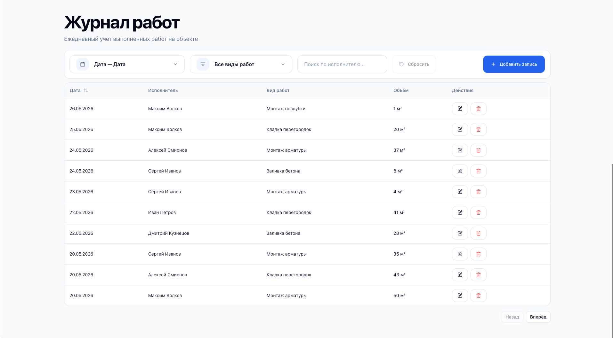

# Журнал работ — Frontend

Frontend application for the construction work journal system built with React, TypeScript, Vite, Tailwind CSS v4, and TanStack ecosystem.

## Application Preview




## Tech Stack

### Core

- React 19
- TypeScript
- Vite

### Styling & UI

- Tailwind CSS v4
- Radix UI
- Lucide React
- Sonner
- tw-animate-css

### Data & API

- TanStack Query
- TanStack Table
- Axios
- Nuqs

### Forms & Validation

- React Hook Form
- Zod

---

## Features

- CRUD operations for journal entries
- Filtering by:
  - Date range
  - Work type
  - Worker name
- Optimistic cache invalidation with React Query
- URL-synced filters using Nuqs
- Form validation with Zod
- Toast notifications
- Responsive UI
- Reusable design system components

---

## Project Structure

```txt
src/
├── app/
├── entities/
│   ├── journal/
│   └── work-type/
├── pages/
├── shared/
│   ├── api/
│   ├── lib/
│   └── ui/
└── widgets/
```

---

## Getting Started

### Install dependencies

```bash
pnpm install
```

### Start development server

```bash
pnpm dev
```

Application will be available at:

```txt
http://localhost:5173
```

---

## Available Scripts

### Development

```bash
pnpm dev
```

Starts Vite development server.

### Build

```bash
pnpm build
```

Builds the application for production.

### Preview Production Build

```bash
pnpm preview
```

Runs preview server for production build.

### Lint

```bash
pnpm lint
```

Runs ESLint.

---

## Environment Variables

Create `.env` from `.env.example`:

```bash
cp .env.example .env
```
